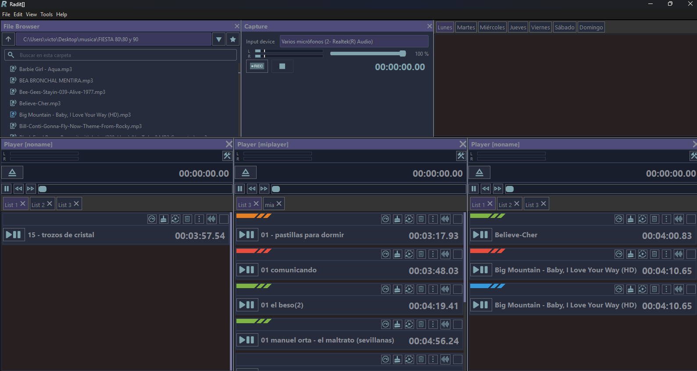
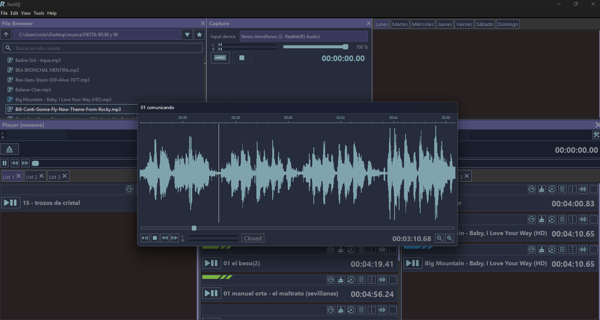
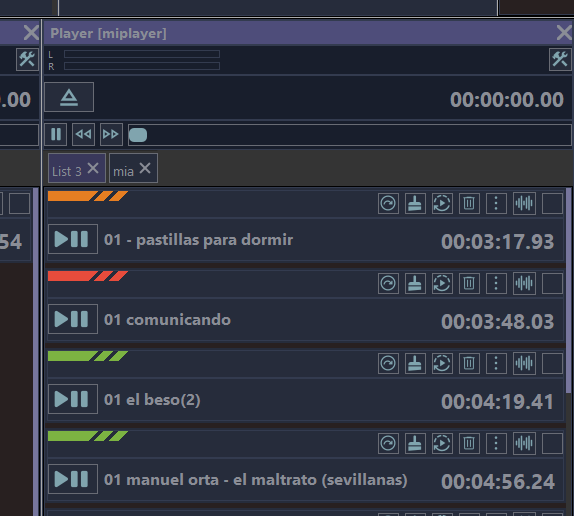
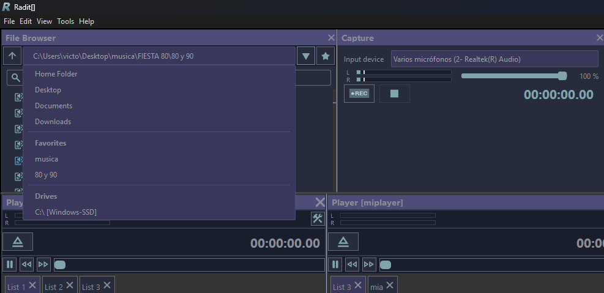

# Radit

Open-source radio automation software.

[Website](https://www.radit.org/) · [Development downloads](https://github.com/valgaba/radit/releases) · [Report an issue](https://github.com/valgaba/radit/issues)

## Development build for Windows

**These are development builds, currently in testing. They may contain bugs and incomplete features.**

1. Open the [Releases page](https://github.com/valgaba/radit/releases) and download `binaries.zip` from a development release.
2. Extract the entire `binaries` folder, preserving its subfolders.
3. Run `binaries/radit.exe`.

The package is portable and intended for 64-bit Windows. Qt Creator is not required. Keep the included libraries and plugins alongside the executable. The package includes only the main Radit executable; experimental `radit-*.exe` builds are excluded. `ffmpeg/ffmpeg.exe` is an internal audio dependency.

Audio devices may need to be selected in the player options on your computer.

## Screenshots

Actual software screenshots supplied by the project maintainer.

### Main interface

### Waveform view

### Playlists

### File browser

## Feedback and improvements

Follow the [release notes](https://github.com/valgaba/radit/releases) for updates. To report a problem, open an [issue](https://github.com/valgaba/radit/issues) with your Windows version, the development build you used, steps to reproduce the problem and a screenshot if useful.

## Support the project

[Donate through PayPal](https://www.paypal.com/donate?hosted_button_id=LPGEM5WJTL5HW)

## License

Radit is distributed under [GPL-3.0](LICENSE). Bundled third-party components retain their respective licenses.

---

## Español

Radit es un proyecto de software libre para la automatización de emisoras de radio.

**Las descargas son versiones de desarrollo en fase de pruebas. Pueden contener errores y funciones incompletas.**

Descarga `binaries.zip` desde [Releases](https://github.com/valgaba/radit/releases), extrae la carpeta `binaries` completa y ejecuta `radit.exe`. Conserva las bibliotecas y subcarpetas incluidas. El paquete es portable para Windows de 64 bits y no requiere Qt Creator. Selecciona los dispositivos de audio desde las opciones del reproductor si es necesario.

Puedes seguir las mejoras en las notas de cada versión y comunicar problemas en [Issues](https://github.com/valgaba/radit/issues).

[Web en español](https://www.radit.org/es.html) · [Anterior proyecto Radit](https://www.radit.org/sources/) · [Donar al proyecto](https://www.paypal.com/donate?hosted_button_id=LPGEM5WJTL5HW)

